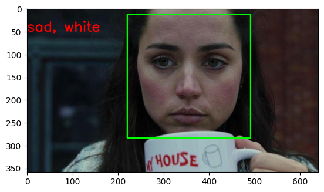

############################################
# Real-Time Emotion Detection using DeepFace and OpenCV
############################################

This project utilizes machine learning models for real-time emotion detection via a webcam feed.
Built using DeepFace, OpenCV, and Python, the project detects and displays the dominant emotion
on a live video feed.

============================================
# TABLE OF CONTENTS
============================================
- 1. Overview
- 2. Features
- 3. Installation
- 4. Usage
- 5. Demo
- 6. Dependencies
- 7. Contributing
- 8. License

============================================
## 1. OVERVIEW
============================================

Emotion recognition is an exciting domain in AI and computer vision. This project enables:
- Real-time detection of facial emotions like happy, sad, angry, and more.
- Integration with live video feed to draw emotion-based annotations.

============================================
## 2. FEATURES
============================================

- Real-time Emotion Detection: Detects emotions directly from your webcam feed.
- Face Detection: Draws bounding boxes around detected faces.
- User-Friendly Notebook Interface: Designed to simplify execution.
- Customizable Model: Expandable to include additional emotion analysis.

============================================
## 3. INSTALLATION
============================================

Follow these steps to set up the project:

1. Clone the Repository:
   git clone https://github.com/Defalt-Meh/NLP-SENTIMENT-ANALYSIS.git
   cd real-time-emotion-detection

2. Set Up Python Environment:
   python3 -m venv venv
   source venv/bin/activate  # For Linux/Mac

3. Jupyter Notebook Setup:
   pip install notebook

============================================
## 4. USAGE
============================================

To use this project, follow these steps:

Using Jupyter Notebook:
1. Launch Jupyter Notebook:
   jupyter notebook
2. Open main.ipynb.
3. Follow the instructions in the notebook to execute cells step by step.

Using the Script:
Convert the notebook into a standalone script for direct execution:
   python main.py

============================================
## 5. DEMO
============================================

Below is a sample output from the project:

Emotion Detection Example: 

============================================
## 6. DEPENDENCIES
============================================

The project requires the following Python packages:
- OpenCV (opencv-python, opencv-contrib-python)
- DeepFace (deepface)
- Jupyter Notebook
- TensorFlow or its compatible libraries

============================================
## 7. CONTRIBUTING
============================================

Contributions are welcome! Here’s how you can help:

- 1. Fork the repository.
- 2. Clone your fork:
   git clone https://github.com/your-username/real-time-emotion-detection.git
- 3. Create a branch for your feature or bug fix:
   git checkout -b feature-name
- 4. Commit your changes:
   git commit -m "Add feature description"
- 5. Push your changes:
   git push origin feature-name
- 6. Open a pull request on the main repository.

============================================
## 8. LICENSE
============================================

This project is licensed under the MIT License.

============================================
## ACKNOWLEDGMENTS
============================================

Special thanks to:
- DeepFace for providing powerful facial analysis.
- OpenCV for image and video processing capabilities.
- Inspiration from the open-source community.
